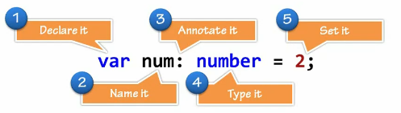

# Grammar

## Basics




The word **annotation** here is very important for reconciling the difference between what Typescript is and what Javascript is. That is, **Typescript isn't real**, and this is a perfect example of why. Typescript ultimately transpiles into Javascript after its done being written, so the writer is allowed to do things like the above example.

**In a way similar to pseudo-code, we are allowed an** _**annotation**_ **that is useful at build-time but ultimately disappears.**


In a sense, one might say that **Typescript** is more of an **annotation** of Javascript rather than a **"superset" of it.** \(Perhaps this is all "superset" means, and I just don't understand the word properly.\)

## Functions

There are **two ways** to annotate and/or declare Functions:



One can first define a **sort-of** **interface** that will **describe** the upcoming function value assignment. For example:

```typescript
//* First we annotate...
let addTwo: (a: number, b: number) => number;

//* _Then_ we define
addTwo = function (a, b) { 
    return a + b 
}

//* Or...
addTwo = (a, b) => a + b;
```

On line one, we use an **arrow function-like** syntax to **annotate** the types of **each parameter** as well as the **return** **value**'s type. 

_Then_ we define the function itself in a way one might do in regular JS.

**HOWEVER!**

What is _really_ happening is that we are creating an **interface** with the first expression. To write it more explicitly, it would be:

```typescript
interface IAddTwoInterface {
    (a: number, b: number): number;
}

const addTwo: IAddTwoInterface = (a, b) => a + b;

//* Or...
function addTwo(a, b): IAddTwoInterface {
    return a + b;
}
```

Note that in the above example, the **interface** is being used to **annotate the type** of the `addTwo` function that we are defining. The interface is effectively saying "this is a thing that looks like _this_"



Using this method, the function is **annotated** _and_ **defined** both at one. This works when using arrow functions...

```typescript
const addTwo = (a: number, b: number): number => a + b;
```

Or using the `function` keyword:

```typescript
function addTwo(a: number, b: number): number {
    return a + b;
}
```



> While time and experience may change my view, the **"interface first" approach** seems to be the **more readable** of the two. I am reminded of an the phrase for public speaking, **"tell them what you are going to tell them, tell them, then tell them what you told them."**


**Optional Parameters** are annotated in the same way that **optional object properties** are, with the `?` character like so: `function hello(name?: string)`


## Objects

When **annotating** an **object literal**, the `?` character is used to indicate an **optional property:**

```typescript
let dog = {
    breed: string;
    name?: string;
}
```

Objects can also be defined using an **interface** like so:

```typescript
interface Dog {
    breed: string;
    name?: string;
    bark: () => string;
}

let myDog = {
    breed: "doggo",
    bark: () => "woof!"
}

let myOtherDog = {
    breed: "pupper",
    name: "bob",
    bark: () => "yip!"
}
```

 


